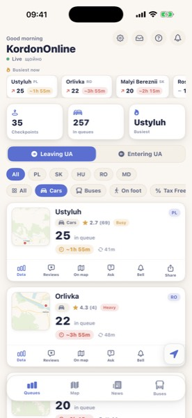
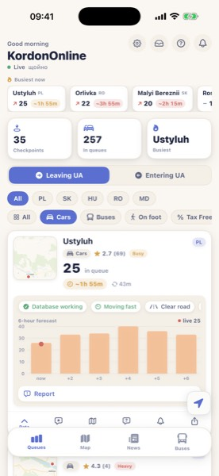
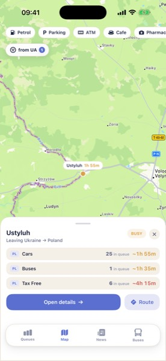

[English](README.md) | [Deutsch](README.de.md) | [Українська](README.uk.md) | [Français](README.fr.md) | [Español](README.es.md) | **Italiano**

# Kordon Online: Border Queues

### Scopri la coda prima di arrivare al confine.

Kordon Online mostra le code e i tempi di attesa in tempo reale ai valichi di frontiera dell'Ucraina, così puoi scegliere il valico migliore e pianificare il viaggio con sicurezza. Chiaro, veloce e pensato per i viaggi reali.

## Scarica

 

## Funzioni

- **Code e tempi di attesa in tempo reale** ai valichi di frontiera dell'Ucraina
- **Previsione del tempo di attesa** per scegliere il momento giusto
- **Riepilogo delle recensioni** degli altri viaggiatori su ogni valico
- **Mappa con filtri e punti di interesse** lungo il percorso
- **Classifica degli autobus** per confrontare i servizi
- **Notifiche** per non dover controllare di continuo
- **App per Apple Watch**: la coda al polso
- **Tema scuro** per un uso confortevole di notte

## Schermate

  

## Link

- Sito web: https://kordon.online
- Pagina dell'app: https://nakordoni.eu/en/apps/kordon/
- Altre app: https://nakordoni.eu/en/apps/

---

© nakordoni.eu, tutti i diritti riservati.

Software proprietario. Questo repository è solo una vetrina del prodotto; non viene concessa alcuna licenza di riutilizzo dei contenuti.
